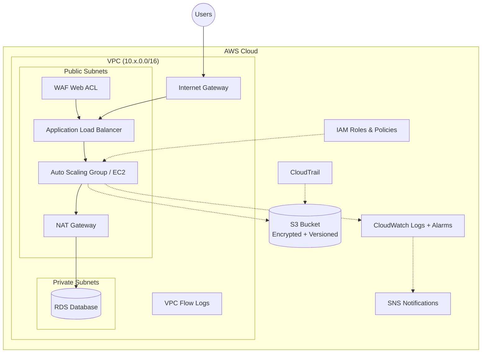

# AWS Infrastructure as Code (IaC) Template

Terraform template for provisioning a secure, modular AWS environment. Follows AWS Well-Architected Framework patterns with environment separation and reusable modules.

---

## Features

- Modular Terraform code (VPC, RDS, IAM, S3, EC2/ASG, ALB, CloudWatch, CloudTrail, WAF, Route53, Security Groups)
- Environment separation (dev / staging / prod) with isolated state
- Remote S3 backend with DynamoDB state locking
- HTTPS/TLS support with ACM certificate integration
- WAF protection with AWS managed rules (SQLi, XSS, rate limiting)
- Auto Scaling Groups for production workloads
- VPC Flow Logs for network traffic auditing
- CloudTrail for API audit logging
- CloudWatch alarms with SNS notifications (CPU, storage, 5xx errors)
- Encrypted S3 buckets with blocked public access
- Private subnets with optional NAT Gateway
- RDS deletion protection for production
- Parameterized variables with per-environment defaults
- Consistent tagging strategy via `default_tags`
- GitHub Actions CI/CD with Checkov security scanning and Infracost
- Scheduled drift detection with automatic issue creation
- Pre-commit hooks (fmt, validate, tflint, tfsec, terraform-docs, checkov)
- Terraform native tests
- Makefile for common operations

---

## Architecture Overview

This template deploys:

- A custom VPC with public and private subnets across multiple AZs
- VPC Flow Logs for network traffic auditing
- Internet Gateway for public access, optional NAT Gateway for private egress
- Application Load Balancer with target groups, health checks, and optional HTTPS
- EC2 instances (dev/staging) or Auto Scaling Groups (prod)
- RDS database in private subnets (MySQL by default, multi-AZ in staging/prod)
- WAF Web ACL protecting the ALB (prod)
- Encrypted S3 bucket for assets
- CloudWatch log groups and alarms with SNS notifications
- CloudTrail for API activity logging
- Least-privilege IAM roles and policies



---

## Repository Structure

```
infrastructure-as-code-aws/
├── modules/                    # Reusable Terraform modules
│   ├── alb/                    # ALB + Target Group + Listeners
│   ├── asg/                    # Auto Scaling Group + Launch Template
│   ├── cloudtrail/             # CloudTrail + S3 logging bucket
│   ├── cloudwatch/             # Log Groups + Alarms + SNS
│   ├── ec2/                    # EC2 Instances
│   ├── iam/                    # IAM Roles & Policies
│   ├── rds/                    # RDS Database
│   ├── route53/                # Route53 Hosted Zone + DNS Records
│   ├── s3/                     # S3 Buckets
│   ├── security-groups/        # Security Groups
│   ├── vpc/                    # VPC, Subnets, IGW, NAT, Flow Logs
│   └── waf/                    # WAF Web ACL
├── envs/                       # Environment configurations
│   ├── dev/
│   ├── staging/
│   └── prod/
│       ├── main.tf             # Module calls with env-specific values
│       ├── variables.tf        # Variable definitions with defaults
│       ├── outputs.tf          # Output exports
│       ├── backend.tf          # Remote state config (S3 + DynamoDB)
│       ├── terraform.tfvars    # Your values (git-ignored)
│       └── terraform.tfvars.example  # Template to copy
├── tests/                      # Terraform native tests
│   ├── vpc.tftest.hcl
│   ├── s3.tftest.hcl
│   └── rds.tftest.hcl
├── scripts/
│   └── bootstrap-backend.sh    # One-time backend setup
├── docs/
│   ├── architecture.mermaid    # Architecture diagram source
│   ├── runbook.md              # Operations guide
│   └── contributing.md         # Contributing guide
├── .github/workflows/
│   ├── terraform.yml           # CI/CD pipeline
│   └── drift-detection.yml     # Scheduled drift detection
├── Makefile                    # Task runner
├── CLAUDE.md                   # AI assistant context
├── .pre-commit-config.yaml
├── .gitignore
├── LICENSE
└── README.md
```

---

## Quick Start

1. **Clone the repo:**
   ```bash
   git clone https://github.com/your-org/infrastructure-as-code-aws.git
   cd infrastructure-as-code-aws
   ```

2. **Bootstrap the backend** (one-time):
   ```bash
   make bootstrap PROJECT=myproject REGION=us-east-1
   ```

3. **Create your tfvars:**
   ```bash
   cd envs/dev
   cp terraform.tfvars.example terraform.tfvars
   # Edit terraform.tfvars with your values
   ```

4. **Deploy:**
   ```bash
   make init ENV=dev
   make plan ENV=dev
   make apply ENV=dev
   ```

---

## Common Commands

```bash
make help              # Show all available targets
make fmt               # Format all Terraform files
make validate-all      # Validate all environments
make plan ENV=dev      # Plan for a specific environment
make apply ENV=prod    # Apply for a specific environment
make docs              # Generate module documentation
make checkov           # Run security scan
make pre-commit        # Run all pre-commit hooks
```

---

## Environment Differences

| Setting              | Dev           | Staging       | Prod             |
|----------------------|---------------|---------------|------------------|
| VPC CIDR             | 10.0.0.0/16   | 10.1.0.0/16   | 10.2.0.0/16      |
| AZs                  | 2             | 2             | 3                |
| NAT Gateway          | Off           | On            | On               |
| VPC Flow Logs        | On (14 days)  | On (30 days)  | On (90 days)     |
| Compute              | EC2           | EC2           | **ASG (2-6)**    |
| RDS Instance         | db.t3.micro   | db.t3.small   | db.t3.medium     |
| RDS Storage          | 20 GB         | 50 GB         | 100 GB           |
| RDS Multi-AZ         | No            | Yes           | **Yes**          |
| Deletion Protection  | No            | No            | **Yes**          |
| Skip Final Snapshot  | Yes           | Yes           | **No**           |
| WAF                  | No            | No            | **Yes**          |
| CloudTrail           | No            | Single-region | **Multi-region** |
| CloudWatch Alarms    | Yes           | Yes           | Yes              |
| Log Retention        | 14 days       | 30 days       | 90 days          |
| EC2 Instance         | t3.micro      | t3.small      | t3.medium        |

---

## Secrets

Pass sensitive values via environment variables instead of tfvars:

```bash
export TF_VAR_db_password="your-secure-password"
```

For CI/CD, store these as GitHub Actions secrets:
- `AWS_ACCESS_KEY_ID`
- `AWS_SECRET_ACCESS_KEY`
- `DB_PASSWORD`
- `INFRACOST_API_KEY` (optional, for cost estimation)

---

## Documentation

- [Operations Runbook](docs/runbook.md) — Common procedures, disaster recovery, troubleshooting
- [Contributing Guide](docs/contributing.md) — Development workflow, conventions, PR process

---

## License

MIT — see [LICENSE](LICENSE).
